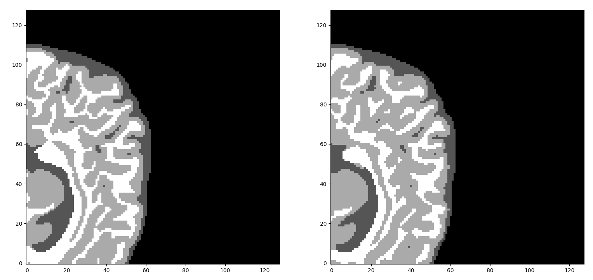

<div align="center">

</div>

# A 3D multi-modal medical image segmentation library in PyTorch
[![Contributors][contributors-shield]][contributors-url]
[![Forks][forks-shield]][forks-url]
[![Stargazers][stars-shield]][stars-url]
[![Issues][issues-shield]][issues-url]
[](https://colab.research.google.com/github/black0017/MedicalZooPytorch/blob/master/Quickstart_MedicalZoo.ipynb)


We strongly believe in open and **reproducible deep learning research**. Our goal is to implement an open-source **medical image segmentation library of state of the art 3D deep neural networks in PyTorch**. We also implemented a bunch of data loaders of the most common medical image datasets.  This project started as an [MSc Thesis](https://nemertes.lis.upatras.gr/jspui/handle/10889/12754 "MSc thesis link") and is currently **under further development.** Although this work was initially focused on **3D multi-modal brain MRI segmentation** we are slowly adding more architectures and data-loaders.  

#### Top priorities 21-07
[Update] 21-07 We have just received a brand new GPU. The project developedment was postponed due to lack of computational resources. We will be back with more updates. Please Watch our Github repository for releases to be notified. We are always looking for passionate open-source contributos. Full credits will be given.

- [ ] Project restructure, API/CLI design ++
- [ ] Minimal test prediction example with pre-trained models
- [ ] Overlapping and non-overlapping inference
- [ ] Finalize preprocessing on Brats datasets
- [ ] Save produced 3d-total-segmentation as nifty files
- [ ] Medical image decathlon dataloaders
- [ ] StructSeg 2019 challenge dataloaders
- [ ] More options for 2D architectures
- [ ] Rewrite manual
- [ ] New notebooks with google colab support

## Quick Start
- If you want to quickly understand the fundamental concepts for deep learning in medical imaging, we strongly advice to check our [blog post](https://theaisummer.com/medical-image-deep-learning/ "MedicalZooPytorch article"). We provide a general high-level overview of all the aspects of medical image segmentation and deep learning.

- Recentrly, I have published another article on medical image coordinated and DICOM images. Link [here](https://theaisummer.com/medical-image-coordinates/).

- For a more holistic approach on Deep Learning in MRI you may advice my thesis [this](https://nemertes.lis.upatras.gr/jspui/handle/10889/12754 "MSc thesis link").

- Alternatively, you can create a **virtual environment** and install the requirements. Check the installation folder for more instructions.

- You can also take a quick glance at the [manual](./manual/README.md).

- If you do not have a capable environment or device to run this projects then you could give Google Colab a try. It allows you to run the project using a GPU device, free of charge. You may try our Colab demo using this notebook:[](https://colab.research.google.com/github/black0017/MedicalZooPytorch/blob/master/Quickstart_MedicalZoo.ipynb)


## Implemented architectures

- #### [U-Net3D](https://arxiv.org/abs/1606.06650) Learning Dense Volumetric Segmentation from Sparse Annotation Learning Dense Volumetric Segmentation from Sparse Annotation

- #### [V-net](https://arxiv.org/abs/1606.04797) Fully Convolutional Neural Networks for Volumetric Medical Image Segmentation

- #### [ResNet3D-VAE](https://arxiv.org/pdf/1810.11654.pdf) 3D MRI brain tumor segmentation using auto-encoder regularization

- #### [U-Net](https://arxiv.org/abs/1505.04597 "official paper") Convolutional Networks for Biomedical Image Segmentation

- #### [SkipDesneNet3D](https://arxiv.org/pdf/1709.03199.pdf) 3D Densely Convolutional Networks for Volumetric Segmentation

- #### [HyperDense-Net](https://arxiv.org/abs/1804.02967) A hyper-densely connected CNN for multi-modal image segmentation

- #### [multi-stream Densenet3D](https://arxiv.org/abs/1804.02967) A hyper-densely connected CNN for multi-modal image segmentation

- #### [DenseVoxelNet](https://arxiv.org/abs/1708.00573) Automatic 3D Cardiovascular MR Segmentation with Densely-Connected Volumetric ConvNets

- #### [MED3D](https://arxiv.org/pdf/1904.00625.pdf) Transfer learning for 3D medical image analysis

- #### [HighResNet3D](https://arxiv.org/pdf/1707.01992.pdf) On the Compactness, Efficiency, and Representation of 3D Convolutional Networks: Brain Parcellation as a Pretext Task

## Implemented medical imaging data-loaders


|Task|Data Info/ Modalities| Train/Test | Volume size | Classes | Dataset size (GB)|
|---|---|---|---|---|---|
| [Iseg 2017](http://iseg2017.web.unc.edu/ "Official iseg-2017 dataset page")| T1, T2 | 10 / 10    |144x192x256|4| 0.72 |
| [Iseg 2019](http://iseg2019.web.unc.edu/ "Official site")| T1, T2 | 10 / 13   |144x192x256|4| 0.75 |
| [MICCAI BraTs2018](https://www.med.upenn.edu/sbia/brats2018/data.html "Brain Tumor Segmentation Challenge 2018") |FLAIR, T1w, T1gd,T2w |285 / - |240x240x155|9 or 4|2.4|
|  [MICCAI BraTs2019](https://www.med.upenn.edu/cbica/brats2019/data.html  "Brain Tumor Segmentation Challenge 2019") |FLAIR, T1w, T1gd,T2w |335 / 125 |240x240x155|9 or 4|4|
| [Mrbrains 2018](https://mrbrains18.isi.uu.nl/ "Mrbrains 2018 official website") |FLAIR, T1w, T1gd,T2w |8 |240x240x48|9 or 4|0.5|
|[IXI brain development Dataset ](https://brain-development.org/ixi-dataset/  "IXI Dataset")| T1,T2 **no labels** | 581 |(110~150)x256x256|-|8.7|
|[MICCAI Gleason 2019 Challenge](https://gleason2019.grand-challenge.org/ "MICCAI2019 Gleason challenge")| 2D pathology images | ~250 |5K x 5K|-|2.5|


## Preliminary results

### Visual results on Iseg-2017



### Iseg and Mr-brains 
| Model | # Params (M) | [MACS](https://en.wikipedia.org/wiki/Multiply%E2%80%93accumulate_operation)(G) |   Iseg 2017 [DSC](https://en.wikipedia.org/wiki/S%C3%B8rensen%E2%80%93Dice_coefficient) (%) | Mr-brains 4 classes DSC (%) |
|:-----------------:|:------------:|:--------:|:-------------------:|:-------------------:|
|   Unet3D   |   17 M   |  0.9  |  **93.84**  | **88.61** |
|   Vnet   |   **45 M**   |  12  |   87.21 | 84.09 |
|   DenseNet3D   |   3 M   |   5.1   |  81.65 |79.85|
|   SkipDenseNet3D   |   1.5 M   |   **31**   |  - |-|
|  DenseVoxelNet  |   1.8 M   |   8    | - | - |
|  HyperDenseNet  |   10.4 M   |   5.8   | - | - |


## Usage

#### How to train your model 
- For **Iseg-2017** :
```
python ./examples/train_iseg2017_new.py --args
```
- For **MR brains 2018** (4 classes)
```
python ./examples/train_mrbrains_4_classes.py --args
```
- For **MR brains 2018** (8 classes)
```
python ./examples/train_mrbrains_9_classes.py --args
```
- For MICCAI 2019 Gleason Challenge
```
python ./examples/test_miccai_2019.py --args
```
-  The arguments that you can modify are extensively listed in the [manual](./manual/README.md).
## Inference 

#### How to test your trained model in a medical image
```
python ./tests/inference.py --args
```

## Covid-19 segmentation and classification
We provide some implementations around Covid-19 for humanitarian purposes. In detail:

### Classification model

-  [COVID-Net]( https://arxiv.org/pdf/2003.09871.pdf) A Tailored Deep Convolutional Neural Network Design for Detection of COVID-19 Cases from Chest Radiography Images

### Datasets 

#### Classification from 2D images:
-  [COVID-CT dataset](https://arxiv.org/pdf/2003.13865.pdf)

-  [COVIDx dataset](https://github.com/IliasPap/COVIDNet/blob/master/README.md)

#### 3D COVID-19 segmentation dataset
- [COVID-19 CT Lung and Infection Segmentation Dataset](https://zenodo.org/record/3757476#.XqgcL3Uzbmt)


## Latest features (06/2020)

- On the fly 3D total volume visualization
- Tensorboard and PyTorch 1.4+ support to track training progress
- Code cleanup and packages creation
- Offline sub-volume generation 
- Add Hyperdensenet, 3DResnet-VAE, DenseVoxelNet
- Fix mrbrains,Brats2018,Brats2019, Iseg2019, IXI,MICCAI 2019 gleason challenge dataloaders
- Add confusion matrix support for understanding training dynamics
- Some Visualizations


## Support 
If you **really** like this repository and find it useful, please consider (★) **starring** it, so that it can reach a broader audience of like-minded people. It would be highly appreciated :) !

## Contributing to Medical ZOO
If you find a bug, create a GitHub issue, or even better, submit a pull request. Similarly, if you have questions, simply post them as GitHub issues. More info on the [contribute directory](./contribute/readme.md).

## Current team

#### [Ilias Papastatis](https://github.com/iliasprc "Git page"), [Sergios Karagianakos](https://github.com/SergiosKar "Git page") and  [Nikolas Adaloglou](https://www.linkedin.com/in/adaloglou17/ "LinkedIn page")

## License , citation and acknowledgements
Please advice the **LICENSE.md** file. For usage of third party libraries and repositories please advise the respective distributed terms. It would be nice to cite the **original models and datasets**. If you want, you can also **cite this work** as:

```
@MastersThesis{adaloglou2019MRIsegmentation,
author = {Adaloglou Nikolaos},
title={Deep learning in medical image analysis: a comparative analysis of
multi-modal brain-MRI segmentation with 3D deep neural networks},
school = {University of Patras},
note="\url{https://github.com/black0017/MedicalZooPytorch}",
year = {2019},
organization={Nemertes}}
```

####  Acknowledgements
In general, in the open source community recognizing third party utilities increases the credibility of your software. In deep learning, **academics tend to skip acknowledging third party repos for some reason**. In essence, we used whatever resource we needed to make this project self-complete, that was nicely written. However, **modifications were performed to match the project structure and requirements**. Here is the list of the **top-based works**: [HyperDenseNet](https://github.com/josedolz/HyperDenseNet_pytorch) model. Most of the segmentation losses from [here](https://github.com/wolny/pytorch-3dunet/blob/master/pytorch3dunet/unet3d/losses.py). 3D-SkipDenseNet model from [here](https://github.com/tbuikr/3D-SkipDenseSeg). 3D-ResNet base model from [here](https://github.com/kenshohara/3D-ResNets-PyTorch). Abstract model class from [MimiCry project](https://github.com/kwotsin/mimicry). Trainer and Writer class from PyTorch [template](https://github.com/victoresque/pytorch-template). Covid-19 implementation based on our previous work from [here](https://github.com/IliasPap/COVIDNet). MICCAI 2019 Gleason challenge data-loaders based on our previous work from [here](https://github.com/black0017/MICCAI-2019-Prostate-Cancer-segmentation-challenge). Basic 2D Unet implementation from [here](https://github.com/milesial/Pytorch-UNet).Vnet model from [here](https://github.com/mattmacy/vnet.pytorch)


[contributors-shield]: https://img.shields.io/github/contributors/black0017/MedicalZooPytorch.svg?style=flat-square
[contributors-url]: https://github.com/black0017/MedicalZooPytorch/graphs/contributors
[forks-shield]: https://img.shields.io/github/forks/black0017/MedicalZooPytorch.svg?style=flat-square
[forks-url]: https://github.com/black0017/MedicalZooPytorch/network/members

[stars-shield]: https://img.shields.io/github/stars/black0017/MedicalZooPytorch.svg?style=flat-square
[stars-url]: https://github.com/black0017/MedicalZooPytorch/stargazers

[issues-shield]: https://img.shields.io/github/issues/black0017/MedicalZooPytorch.svg?style=flat-square
[issues-url]: https://github.com/black0017/MedicalZooPytorch/issues
